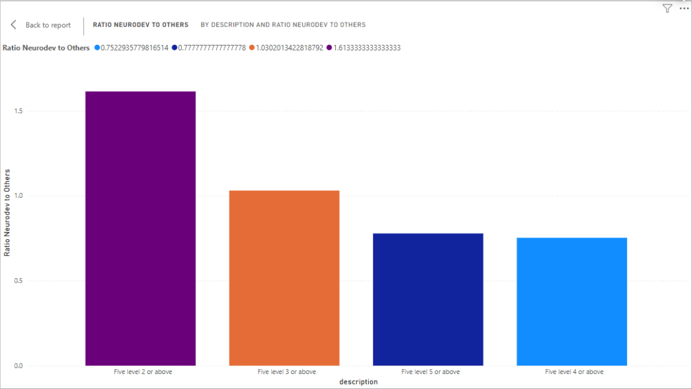
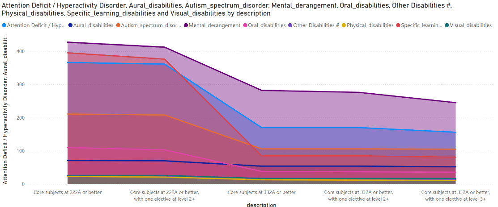
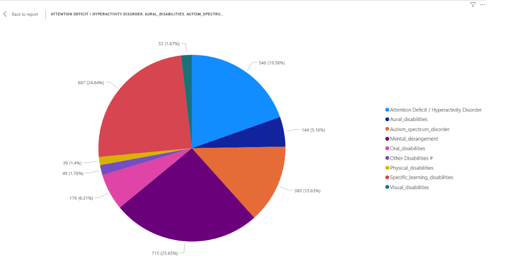

# Analyzing the Impact of Special Needs on Academic Performance Trends in the HKDSE

This repository presents an analysis of how various special needs influence academic performance trends in the Hong Kong Diploma of Secondary Education (HKDSE). The project explores the relationship between different categories of special needs and grade outcomes, aiming to identify patterns and insights that may inform educational strategies and support mechanisms for students with special needs.

---

## **Overview**

- **Objective:**  
  Examine how different types of special needs affect HKDSE performance, with a focus on identifying trends, disparities, and potential areas for targeted educational support.

- **Dataset:**  
  The analysis uses the “2024 HKDSE Statistics on performance of candidates with special needs (English Version)” from [data.gov.hk](https://data.gov.hk/en-data/dataset/hkeaa-hkdesstat-result-table3-2024/resource/3b9324c7-bfd8-4fa8-925a-55f24d5d74a5). The dataset includes numerical data on HKDSE results and special needs demographics.

---

## **Data Processing**

- **Cleaning and Structuring:**  
  Used the pandas library to:
  - Handle missing values
  - Remove redundancies
  - Standardize formats

- **Data Separation:**  
  The dataset was split into two CSV files:
  - One focused on the number of candidates achieving each HKDSE level
  - One analyzing scores in core subjects and electives

---

## **Custom Analysis Columns**

- **Ratio of Neurodevelopmental Disabilities to Other Disabilities:**  
  - Calculates the ratio of students with Specific Learning Disabilities, Autism Spectrum Disorder, and ADHD to those with other disabilities.
  - Reveals prevalence and trends of neurodevelopmental disabilities across academic levels.

- **Predominant Disability Category:**  
  - Identifies the category (Physical/Sensory, Neurodevelopmental, Other) with the highest count at each academic level.
  - Accounts for ties and simplifies the data into broader, meaningful groupings.

---

## **Visualizations**

### **Visualization 1: Neurodevelopmental Ratio by Academic Level**
Shows the average ratio of students with neurodevelopmental disabilities across academic levels.

- **Findings:**  
  - Higher ratios at lower academic levels ('Five level 2 or above', 'Five level 3 or above')
  - Plateau at higher levels suggests complex factors or improved interventions

### **Visualization 2: Disability Prevalence Across Levels**
Compares trends in specific disabilities (e.g., Autism Spectrum Disorder vs. Aural Disabilities).

- **Findings:**  
  - ASD prevalence decreases more sharply than physical disabilities as academic level increases
  - Indicates that neurodevelopmental conditions may respond more to academic interventions

### **Visualization 3: Distribution of Disability Categories**
Displays the proportion of each disability type within the special needs student population.

- **Findings:**  
  - Mental derangement (25.65%) and ADHD are the most prevalent
  - Visual and physical disabilities are less common

---

## **Key Insights**

- Students with neurodevelopmental disabilities face greater challenges at lower academic levels, but ratios stabilize at higher levels, possibly due to effective interventions or more complex influencing factors.
- Neurodevelopmental disabilities (especially ASD) show a sharper decline in prevalence at higher academic levels compared to physical disabilities, suggesting varying impacts and intervention efficacy.
- The uneven distribution of disability categories highlights the need for targeted resources, especially for more prevalent conditions like mental derangement and ADHD.

---

## **References**

- 2024 HKDSE Statistics on performance of candidates with special needs (English Version), data.gov.hk
- Hong Kong Examinations and Assessment Authority - Examination Report

**Note:**  
All data and analysis are for educational and research purposes. For more details, see the original dataset and the full paper in this repository.
